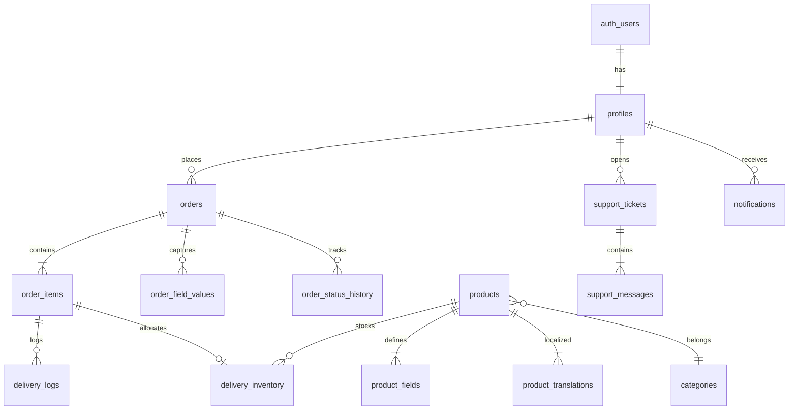

# riont — Database Architecture (Supabase PostgreSQL)

> **Master plan:** [MASTER_ARCHITECTURE.md](./MASTER_ARCHITECTURE.md) §3  
> **Source of truth:** `supabase/migrations/*.sql`  
> **Types:** `supabase gen types typescript` → `src/types/database.ts`  
> **No Prisma.** Money in **integer cents** (USD base).  
> **Phase 1:** No payment tables.

---

## 1. Entity relationship (Phase 1)



`auth.users` managed by Supabase Auth. App tables in `public` schema.

---

## 2. ENUM types (SQL)

```sql
CREATE TYPE user_role AS ENUM ('customer', 'admin');
CREATE TYPE product_status AS ENUM ('draft', 'active', 'archived');
CREATE TYPE delivery_mode AS ENUM ('auto', 'manual');
CREATE TYPE inventory_status AS ENUM ('available', 'allocated', 'delivered', 'revoked');
CREATE TYPE order_status AS ENUM (
  'pending_review', 'awaiting_payment', 'payment_received',
  'processing', 'delivered', 'completed', 'cancelled',
  'needs_customer_response', 'on_hold'
);
CREATE TYPE order_item_fulfillment_status AS ENUM ('pending', 'allocated', 'delivered', 'failed');
CREATE TYPE delivery_log_type AS ENUM ('auto_delivered', 'manual_delivered', 'resent', 'revoked', 'failed');
CREATE TYPE field_type AS ENUM ('text', 'textarea', 'email', 'password', 'select', 'checkbox', 'radio', 'url', 'number');
CREATE TYPE support_ticket_status AS ENUM ('open', 'waiting_customer', 'waiting_admin', 'resolved', 'closed');
CREATE TYPE support_ticket_type AS ENUM ('general', 'fulfillment', 'order_issue');
CREATE TYPE coupon_type AS ENUM ('percent', 'fixed');
```

Use snake_case in DB; map to camelCase in TS services if preferred.

---

## 3. Core tables (Phase 1)

### 3.1 profiles

| Column | Type | Notes |
|--------|------|-------|
| id | uuid PK | FK → auth.users(id) ON DELETE CASCADE |
| role | user_role | default `customer` |
| locale | text | default `en` |
| display_name | text | |
| created_at | timestamptz | |
| updated_at | timestamptz | |

**Trigger:** `on_auth_user_created` → insert profile row.

---

### 3.2 categories / category_translations

- `categories`: id, icon_url, sort_order, is_active  
- `category_translations`: category_id, locale, name, description, slug, meta_title, meta_description  

**Unique:** `(category_id, locale)`, `(locale, slug)`

---

### 3.3 products / product_translations / product_media

- `products`: category_id, status, delivery_mode, price_cents, compare_at_cents, cost_cents, sort_order, is_featured, sales_count  
- `product_translations`: product_id, locale, name, short_description, description, **deliverables**, **requirements**, slug, meta_*, og_image_url  
- `product_media`: product_id, media_type (`image`|`video`), storage_path, alt, sort_order  

**Storage:** `product-images` (images), `product-videos` (mp4/webm, admin upload).

**Index:** `(status, sort_order)`, `(category_id, status)`

---

### 3.4 product_fields

Checkout/order field definitions per product.

---

### 3.5 delivery_inventory

| Column | Type |
|--------|------|
| id | uuid |
| product_id | uuid FK |
| status | inventory_status |
| payload_encrypted | text |
| payload_version | int |
| order_item_id | uuid FK nullable |
| allocated_at, delivered_at | timestamptz |
| imported_batch_id | text |
| notes | text |

**Indexes:**

```sql
CREATE INDEX idx_inventory_product_status ON delivery_inventory (product_id, status);
CREATE INDEX idx_inventory_fifo ON delivery_inventory (product_id, status, created_at);
CREATE UNIQUE INDEX idx_inventory_order_item ON delivery_inventory (order_item_id) WHERE order_item_id IS NOT NULL;
```

---

### 3.6 orders

| Column | Type |
|--------|------|
| id | uuid |
| order_number | text UNIQUE |
| user_id | uuid FK profiles nullable |
| guest_email | text |
| status | order_status |
| subtotal_cents, discount_cents, total_cents | int |
| currency | text |
| coupon_id | uuid nullable |
| coupon_code_snapshot | text |
| locale | text |
| customer_note | text |
| admin_note | text |
| ip_hash | text |
| terms_accepted_at | timestamptz |
| submitted_at | timestamptz |
| payment_received_at | timestamptz |
| processing_started_at | timestamptz |
| delivered_at | timestamptz |
| completed_at | timestamptz |
| cancelled_at | timestamptz |
| display_currency | text | display-only snapshot |
| display_rate | numeric | USD→display at submit |
| total_display_cents | int | optional |
| created_at, updated_at | timestamptz |

**Index:** `(status, created_at DESC)`, `(user_id, created_at DESC)`, `(order_number)`

---

### 3.7 order_status_history

Append-only audit of status transitions.

---

### 3.8 order_items / order_field_values / delivery_logs

Per prior domain spec (snake_case columns).

---

### 3.9 coupons / coupon_products / coupon_categories

Standard restriction tables.

---

### 3.10 support_*

`tickets`, `messages`, `attachments` (storage_path not URL).

---

### 3.11 notifications / audit_logs / guest_order_access / site_settings

Singleton `site_settings` for payment instructions EN/AR (external payment copy).

### 3.12 content_blocks

Homepage CMS — `key`, `locale`, `content` (jsonb), `is_active`, `sort_order`. Unique `(key, locale)`.

### 3.13 exchange_rates

`base_currency` (USD), `target_currency`, `rate`, `fetched_at`. Unique `(base, target)`.

### 3.14 profiles — optional

`preferred_currency` text nullable for logged-in display override.

---

## 4. RLS strategy (balanced)

> **Primary security:** service layer + `assertAdmin` / `assertOrderOwner`.  
> **RLS:** safety net for any user-scoped client reads — not the only admin gate.

### 4.1 RLS ON (recommended)

| Table | Policy summary |
|-------|----------------|
| profiles | SELECT/UPDATE own row (`id = auth.uid()`) |
| orders | SELECT own (`user_id = auth.uid()`) |
| order_items | SELECT via order ownership join |
| order_field_values | SELECT own orders (non-sensitive columns only in view — sensitive via service) |
| notifications | SELECT/UPDATE own |
| support_tickets | SELECT/INSERT own; UPDATE limited |
| support_messages | SELECT via ticket ownership |

### 4.2 RLS OFF or service-role only (recommended)

| Table | Reason |
|-------|--------|
| delivery_inventory | Secrets — never expose to anon/authenticated SELECT |
| delivery_logs | Admin + system only |
| audit_logs | Admin only |
| products write | Admin service role |
| guest_order_access | Token logic in service, not JWT |

**Implementation:** `ALTER TABLE delivery_inventory ENABLE ROW LEVEL SECURITY;` with **no policies** for anon/authenticated → deny all except service_role.

### 4.3 Public catalog read

**Option A (simple MVP):** RLS policy on `products` + `product_translations`:

```sql
CREATE POLICY "public_read_active_products"
ON products FOR SELECT
TO anon, authenticated
USING (status = 'active');
```

Join translations in query. Admin writes use service role (bypasses RLS).

**Option B:** All catalog via Server Components + service role read — no public RLS.  
**Chosen for riont:** Option A for simpler anon key usage in server client.

### 4.4 Admin operations

All admin mutations:

1. Verify `profiles.role = 'admin'` in service  
2. Use `createAdminClient()`  

Do not rely on a complex `is_admin()` RLS policy alone.

---

## 5. RPC functions (SQL)

### 5.1 allocate_inventory

```sql
-- Pseudocode in migration
CREATE OR REPLACE FUNCTION allocate_inventory(p_order_item_id uuid, p_qty int)
RETURNS jsonb
LANGUAGE plpgsql
SECURITY DEFINER
SET search_path = public
AS $$
  -- FOR UPDATE SKIP LOCKED loop
  -- update delivery_inventory, order_items
  -- return { success, allocated_count }
$$;
```

`SECURITY DEFINER` — only callable from service role or locked-down grant.

### 5.2 generate_order_number

Sequence or `RNT-YYYY-#####` via SQL function.

---

## 6. Migrations workflow

```bash
supabase init
supabase migration new create_core_tables
supabase db push          # dev
supabase db push --linked # prod via CI
```

**Rules:**

- One concern per migration file when possible  
- Never edit old migrations after deploy — add new migration  
- Seed: `supabase/seed.sql` for dev admin + sample products  

---

## 7. Type generation

After migrate:

```bash
supabase gen types typescript --linked > src/types/database.ts
```

Services import `Tables`, `Enums` from generated types.

---

## 8. Indexing summary

| Query | Index |
|-------|-------|
| Admin order queue | `(status, created_at DESC)` |
| Customer orders | `(user_id, created_at DESC)` |
| Product by slug | `product_translations(locale, slug)` |
| Stock count | `(product_id, status)` |

---

## 9. Realtime & Edge

- **Realtime:** not used in MVP  
- **Edge Functions:** not required (Next.js Server Actions sufficient)  
- **Payment tables:** not planned — no `payments` / `payment_events` tables  

---

## Appendix A — Removed concepts

| Removed | Replacement |
|---------|-------------|
| Prisma schema | SQL migrations |
| Auth.js Session table | Supabase Auth sessions (cookies) |
| Neon-specific config | Supabase project settings |

---

*Services: [SYSTEM_ARCHITECTURE.md](./SYSTEM_ARCHITECTURE.md)*  
*Security: [SECURITY.md](./SECURITY.md)*
