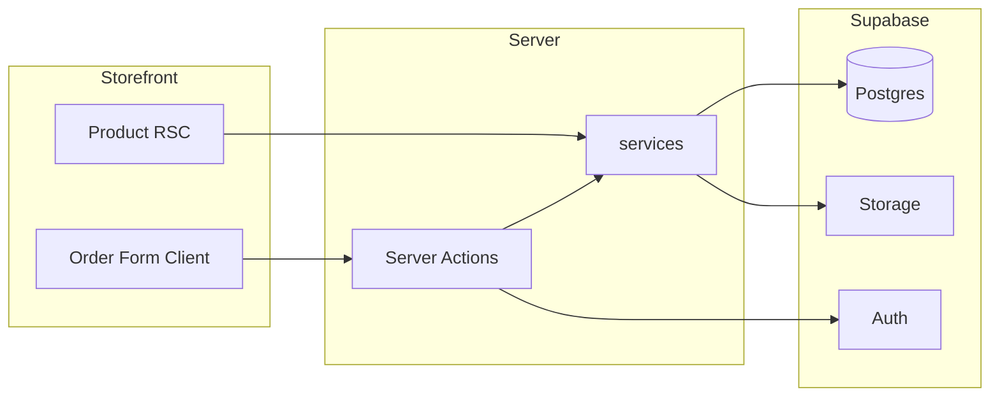

# RIONT — Master Architecture & Execution Plan

> **Version:** 1.0 FINAL  
> **Status:** Implementation-ready — **no application code until sign-off**  
> **Stack:** Next.js 15 + Supabase + Vercel + Resend + Sentry  
> **Scope:** Order management + fulfillment — **external payment only** (no in-app payment SDKs)

This document is the **single source of truth**. Supporting docs extend specific areas; when in conflict, **this document wins**.

| Deep-dive doc | Topic |
|---------------|-------|
| [REQUIREMENTS_ALIGNMENT.md](./REQUIREMENTS_ALIGNMENT.md) | Client requirements vs plan |
| [DESIGN_SYSTEM.md](./DESIGN_SYSTEM.md) | Tokens, components |
| [IMPLEMENTATION_RULES.md](./IMPLEMENTATION_RULES.md) | Engineering standards (mandatory) |

---

## Document map

| § | Section |
|---|---------|
| 1 | [System architecture](#1--final-system-architecture) |
| 2 | [Folder structure](#2--final-folder-structure) |
| 3 | [Database architecture](#3--final-database-architecture) |
| 4 | [Supabase architecture](#4--supabase-architecture) |
| 5 | [Currency system](#5--currency-system-display-only) |
| 6 | [Security architecture](#6--security-architecture) |
| 7 | [SEO architecture](#7--seo-architecture) |
| 8 | [UI/UX system](#8--uiux-system) |
| 9 | [Implementation rules](#9--implementation-rules) → [IMPLEMENTATION_RULES.md](./IMPLEMENTATION_RULES.md) |
| 10 | [Development roadmap](#10--development-execution-roadmap) |
| 11 | [Testing strategy](#11--testing-strategy) |
| 12 | [Production & deployment](#12--production--deployment) |
| 13 | [MVP vs future](#13--mvp-vs-future-features) |

---

# 1 — Final system architecture

## 1.1 Platform identity

| Scope | Definition |
|-------|------------|
| **MVP** | Premium digital marketplace for **submitting orders**, admin review, **external payment**, hybrid **auto/manual delivery**, support, SEO, EN/AR |

**Not in scope:** Integrated payments (Stripe, PayPal, Binance, checkout webhooks, in-app billing). Payment is always confirmed manually by admin after external transfer.

## 1.2 Layered architecture

```
┌─────────────────────────────────────────────────────────────────┐
│ PRESENTATION — Next.js App Router                               │
│  RSC pages (SEO) · Client islands (forms, motion)               │
│  Server Actions (thin) · middleware (locale, session, currency) │
└────────────────────────────┬────────────────────────────────────┘
                             │
┌────────────────────────────▼────────────────────────────────────┐
│ APPLICATION — src/server/services/ + src/server/actions/        │
│  Business rules · validation · encryption · authorization       │
└────────────────────────────┬────────────────────────────────────┘
                             │
┌────────────────────────────▼────────────────────────────────────┐
│ INFRASTRUCTURE — Supabase + Resend + Sentry + (Inngest)         │
│  Postgres · Auth · Storage · optional Redis                     │
└─────────────────────────────────────────────────────────────────┘
```

**Boundary rule:** UI never calls Supabase admin client. UI never decrypts inventory.

## 1.3 Request lifecycle (customer order submit)

```
1. Browser: Product form (Client) + dynamic fields
2. Server Action: submitOrderAction(input)
3. auth.service: getSession() (optional user)
4. order.service.submitOrder():
   a. Zod validate
   b. currency.service: snapshot display currency (metadata only)
   c. coupon.service: quote discount
   d. inventory.service: stock check (AUTO)
   e. encryption: sensitive field values
   f. supabaseAdmin: insert order graph
   g. guest token if needed
5. notification.service: email + in-app
6. Return { orderNumber, guestToken? }
7. revalidatePath optional
8. Client: redirect to confirmation
```

## 1.4 Service responsibilities

| Service | Owns |
|---------|------|
| `auth.service` | Session, profile, assertAdmin, assertUser |
| `product.service` | Catalog, translations, images, fields CRUD |
| `category.service` | Categories + translations |
| `order.service` | Submit, status machine, guest access, admin queue |
| `delivery.service` | Fulfillment orchestration, manual deliver, resend |
| `inventory.service` | Stock counts, CSV import, encrypt payloads |
| `support.service` | Tickets, messages, attachments |
| `notification.service` | In-app + Resend templates |
| `coupon.service` | Validate, apply quote, usage increment |
| `currency.service` | Geo → currency, rates cache, format display |
| `content.service` | Homepage blocks, site settings (CMS-lite) |
| `customer.service` | Admin customer list, order history per user |
| `audit.service` | audit_logs + order_status_history helpers |

## 1.5 Admin architecture

- Route group: `src/app/admin/` — separate layout, dark compact UI  
- Every page: RSC loads data via services after layout calls `assertAdmin`  
- Mutations: Server Actions in `src/server/actions/admin/*.ts`  
- No Supabase Dashboard edits in production for business data  

## 1.6 Order workflow (state machine)

| Status | Customer label (i18n) | Admin action |
|--------|----------------------|--------------|
| `pending_review` | Order received | Accept / Cancel / Hold |
| `awaiting_payment` | Awaiting payment | Mark paid / Message |
| `payment_received` | Payment confirmed | Start fulfillment |
| `processing` | Preparing | — |
| `delivered` | Delivered | Complete |
| `completed` | Completed | — |
| `needs_customer_response` | Action needed | — |
| `on_hold` | On hold | Resume |
| `cancelled` | Cancelled | — |

## 1.7 Delivery workflow

**AUTO:** `processing` → RPC `allocate_inventory` → decrypt → `delivery_logs` → notify → item `delivered` → order `delivered` when all items done.

**MANUAL:** `processing` → auto ticket `fulfillment` → admin message/deliver → `manual_delivered` log.

## 1.8 Support workflow

Ticket types: `general`, `fulfillment`, `order_issue`. Messages + optional attachments (private Storage). Status: open ↔ waiting_customer ↔ waiting_admin → resolved → closed.

## 1.9 SEO workflow

- All indexable routes under `src/app/[locale]/`  
- Product/category data from Supabase in RSC  
- `generateMetadata` per page  
- Sitemap route reads DB  
- JSON-LD in RSC  

## 1.10 Notification workflow

Triggers: order submitted, status change, delivery ready, ticket reply. Channels: `notifications` table + Resend (locale from order/profile).

## 1.11 Data flow diagram



---

# 2 — Final folder structure

```
riont/
├── supabase/
│   ├── config.toml
│   ├── migrations/                 # SQL source of truth
│   └── seed.sql
├── messages/
│   ├── en.json
│   └── ar.json
├── public/
│   ├── fonts/
│   └── icons/
├── src/
│   ├── app/
│   │   ├── [locale]/
│   │   │   ├── (storefront)/
│   │   │   │   ├── layout.tsx
│   │   │   │   ├── page.tsx              # home
│   │   │   │   ├── products/
│   │   │   │   │   ├── page.tsx
│   │   │   │   │   └── [slug]/page.tsx
│   │   │   │   ├── categories/
│   │   │   │   │   └── [slug]/page.tsx
│   │   │   │   ├── cart/page.tsx           # optional
│   │   │   │   ├── order/
│   │   │   │   │   ├── review/page.tsx
│   │   │   │   │   └── confirmation/page.tsx
│   │   │   │   ├── account/
│   │   │   │   │   ├── orders/
│   │   │   │   │   ├── tickets/
│   │   │   │   │   └── settings/
│   │   │   │   ├── guest/orders/[token]/page.tsx
│   │   │   │   ├── support/page.tsx
│   │   │   │   └── (legal)/terms|privacy/
│   │   │   ├── (auth)/
│   │   │   │   ├── login/page.tsx
│   │   │   │   ├── register/page.tsx
│   │   │   │   └── callback/route.ts       # OAuth
│   │   │   └── layout.tsx                  # locale + dir
│   │   ├── admin/
│   │   │   ├── layout.tsx                  # admin shell
│   │   │   ├── page.tsx                    # dashboard
│   │   │   ├── orders/
│   │   │   ├── products/
│   │   │   ├── categories/
│   │   │   ├── inventory/
│   │   │   ├── customers/
│   │   │   ├── coupons/
│   │   │   ├── tickets/
│   │   │   ├── content/                    # homepage CMS
│   │   │   └── settings/
│   │   ├── api/
│   │   │   ├── health/route.ts
│   │   │   └── inngest/route.ts            # optional
│   │   ├── sitemap.ts
│   │   ├── robots.ts
│   │   └── layout.tsx                      # root
│   ├── features/                           # feature modules (UI + hooks)
│   │   ├── catalog/
│   │   │   ├── components/
│   │   │   └── hooks/
│   │   ├── order/
│   │   ├── account/
│   │   ├── admin/
│   │   └── support/
│   ├── components/
│   │   ├── ui/                             # primitives (Button, Input…)
│   │   ├── layout/                         # Shell, Sidebar, Topbar
│   │   └── shared/                         # Price, Badge, Skeleton
│   ├── server/
│   │   ├── services/                       # ALL business logic
│   │   │   ├── auth.service.ts
│   │   │   ├── product.service.ts
│   │   │   ├── category.service.ts
│   │   │   ├── order.service.ts
│   │   │   ├── delivery.service.ts
│   │   │   ├── inventory.service.ts
│   │   │   ├── support.service.ts
│   │   │   ├── notification.service.ts
│   │   │   ├── coupon.service.ts
│   │   │   ├── currency.service.ts
│   │   │   ├── content.service.ts
│   │   │   ├── customer.service.ts
│   │   │   └── audit.service.ts
│   │   ├── actions/
│   │   │   ├── order.actions.ts
│   │   │   ├── auth.actions.ts
│   │   │   └── admin/
│   │   │       ├── product.actions.ts
│   │   │       ├── order.actions.ts
│   │   │       └── ...
│   │   └── jobs/                           # Inngest functions
│   │       ├── fulfill-order.ts
│   │       └── send-email.ts
│   ├── lib/
│   │   ├── supabase/
│   │   │   ├── client.ts
│   │   │   ├── server.ts
│   │   │   ├── admin.ts
│   │   │   └── middleware.ts
│   │   ├── encryption.ts
│   │   ├── domain/
│   │   │   ├── enums.ts
│   │   │   └── errors.ts
│   │   └── utils/
│   │       ├── format-price.ts
│   │       └── sanitize-html.ts
│   ├── validations/                        # Zod schemas
│   │   ├── order.schema.ts
│   │   ├── product.schema.ts
│   │   └── admin/
│   ├── hooks/                              # client-only hooks
│   │   ├── use-cart.ts
│   │   └── use-locale.ts
│   ├── types/
│   │   ├── database.ts                     # generated
│   │   └── domain.ts
│   ├── i18n/
│   │   ├── routing.ts
│   │   └── request.ts
│   └── styles/
│       ├── globals.css                     # design tokens
│       └── fonts.ts
├── middleware.ts                           # locale + supabase + currency cookie
├── next.config.ts
├── tailwind.config.ts
├── sentry.client.config.ts
└── docs/
```

**Import rules:** `features/*` → `components/*` → never `server/services` from client.

---

# 3 — Final database architecture

Base currency stored: **USD** (`price_cents`). Display currency converted in app ([§5](#5--currency-system-display-only)).

## 3.1 Table summary

| Table | Purpose |
|-------|---------|
| `profiles` | Extends auth.users, role, locale |
| `categories` | Taxonomy |
| `category_translations` | Localized category + slug |
| `products` | Core product |
| `product_translations` | EN/AR copy + SEO |
| `product_media` | Images + videos (Storage paths) |
| `product_fields` | Dynamic order fields |
| `orders` | Order header + status |
| `order_items` | Line items |
| `order_field_values` | Submitted field values |
| `order_status_history` | Status audit |
| `delivery_inventory` | Encrypted stock |
| `delivery_logs` | Fulfillment audit |
| `support_tickets` | Support |
| `support_messages` | Thread |
| `support_attachments` | File refs |
| `notifications` | In-app |
| `coupons` | Discount rules |
| `coupon_products` | Restrictions |
| `coupon_categories` | Restrictions |
| `site_settings` | Singleton config + payment instructions |
| `content_blocks` | Homepage CMS sections |
| `guest_order_access` | Guest tokens |
| `audit_logs` | Admin audit |
| `exchange_rates` | Cached FX rates |
| `currency_preferences` | Optional user override |

Full column detail: [DATABASE_ARCHITECTURE.md](./DATABASE_ARCHITECTURE.md). Below: additions for master plan.

## 3.2 `content_blocks` (homepage CMS)

| Column | Type | Notes |
|--------|------|-------|
| id | uuid | PK |
| key | text | `hero`, `trust_bar`, `promo_banner` |
| locale | text | `en` \| `ar` |
| content | jsonb | structured section data |
| is_active | boolean | |
| sort_order | int | |
| updated_at | timestamptz | |

**Unique:** `(key, locale)`

## 3.3 `exchange_rates`

| Column | Type | Notes |
|--------|------|-------|
| base_currency | text | `USD` |
| target_currency | text | `SAR`, `AED`, `EUR`… |
| rate | numeric(18,8) | |
| fetched_at | timestamptz | |

**Unique:** `(base_currency, target_currency)`

## 3.4 `orders` currency snapshot

Add columns:

| Column | Type | Notes |
|--------|------|-------|
| display_currency | text | currency shown at submit |
| display_rate | numeric | USD→display rate snapshot |
| total_display_cents | int | optional precomputed display total |

## 3.5 Indexes (critical)

```sql
-- orders admin queue
CREATE INDEX idx_orders_status_created ON orders (status, created_at DESC);
-- catalog
CREATE INDEX idx_product_translations_locale_slug ON product_translations (locale, slug);
-- inventory
CREATE INDEX idx_inventory_product_status ON delivery_inventory (product_id, status);
```

## 3.6 RLS summary

| Table | RLS |
|-------|-----|
| `profiles` | own row read/update |
| `products` (active) | public SELECT |
| `product_translations` | public SELECT join |
| `orders` | own SELECT if user_id set |
| `notifications` | own |
| `support_tickets` | own |
| `delivery_inventory` | **deny all** except service_role |
| `delivery_logs`, `audit_logs` | service_role only |
| Admin writes | **service_role** in services after role check |

## 3.7 RPC functions

- `allocate_inventory(order_item_id, qty)` — transactional  
- `generate_order_number()` — sequential human ID  

## 3.8 Scalability notes

- Paginate admin lists `.range(0, 24)`  
- Archive old `delivery_inventory` delivered rows yearly (ops job, post-launch)  
- Connection pooler for serverless  
- No Realtime Phase 1  

---

# 4 — Supabase architecture

## 4.1 Clients

| File | Runtime | Key |
|------|---------|-----|
| `lib/supabase/client.ts` | Browser | anon |
| `lib/supabase/server.ts` | Server | anon + cookies |
| `lib/supabase/admin.ts` | Server services | service_role |
| `lib/supabase/middleware.ts` | Edge | session refresh |

## 4.2 Auth flow

```
Sign up/in (OAuth or email) → Supabase Auth session cookie
→ middleware refreshes session
→ profiles row (trigger or first-login action)
→ role check for /admin
```

Providers: Google, Apple, email/password (dashboard + Zod).

## 4.3 RBAC

- Role in `profiles.role`: `customer` | `admin`  
- `assertAdmin()` before every admin service call  
- Middleware blocks `/admin` for non-admin  

## 4.4 Storage buckets

| Bucket | Public | Purpose |
|--------|--------|---------|
| `product-images` | Yes | Product/category images |
| `product-videos` | Yes | Product promo clips (optional) |
| `support-attachments` | No | Ticket files |
| `delivery-files` | No | FILE-type deliveries |

**Signed URLs:** 900s TTL, generated server-side only.

**Upload:** Server Action → validate MIME/size → admin client upload.

## 4.5 Server Actions + Supabase

```typescript
'use server'
export async function adminUpdateProductAction(data: unknown) {
  await assertAdmin()
  const parsed = productUpdateSchema.parse(data)
  return productService.update(parsed)
}
```

Never return raw Postgrest errors.

## 4.6 RLS philosophy

> RLS protects accidental exposure. **Authorization logic lives in services.**

---

# 5 — Currency system (display only)

**Not payment conversion.** Prices stored in USD cents; UI shows localized estimate.

## 5.1 Detection strategy

| Priority | Source |
|----------|--------|
| 1 | Cookie `display_currency` (user override) |
| 2 | `profiles.preferred_currency` if logged in |
| 3 | Geo from `x-vercel-ip-country` (Vercel) or middleware GeoIP |
| 4 | Locale fallback (`ar` → SAR, `en` → USD) |
| 5 | Default `USD` |

Country → currency map in `src/lib/domain/currency-map.ts` (e.g. SA→SAR, AE→AED, EG→EGP).

## 5.2 Exchange rates

| Approach | MVP |
|----------|-----|
| Provider | [Frankfurter API](https://www.frankfurter.app) or exchangerate.host (no key) |
| Base | USD |
| Refresh | Cron daily via Vercel cron or Inngest → `exchange_rates` table |
| Cache | DB + optional Upstash 24h |

## 5.3 Display formatting

```typescript
formatDisplayPrice({
  amountCentsUsd: product.price_cents,
  displayCurrency: 'SAR',
  rate: 3.75,
  locale: 'ar',
})
// → "٤٢٫٣٧ ر.س" with dir="ltr" on number span
```

Show disclaimer: *"Approximate price in SAR. Charged amount confirmed on order."* (i18n key)

## 5.4 Order snapshot

On submit, store `display_currency` + `display_rate` on order for consistent confirmation page.

## 5.5 Fallback

If rate fetch fails → show USD only + subtle notice.

---

# 6 — Security architecture

Consolidated checklist — detail: [SECURITY.md](./SECURITY.md).

| Area | Control |
|------|---------|
| Sensitive fields | AES-256-GCM app encryption |
| Inventory | Encrypted blob + service_role only |
| Guest token | 32-byte random, SHA-256 hash stored |
| Admin | middleware + assertAdmin + audit_logs |
| Attachments | Private bucket, MIME allowlist, 5MB |
| Abuse | Turnstile + rate limits on order submit |
| IDOR | order.user_id + guest token validation |
| XSS | Sanitize HTML descriptions |
| CSRF | Server Actions built-in |
| Logging | Redact sensitive keys; Sentry scrubbing |
| Service key | Server env only; CI grep check |

---

# 7 — SEO architecture

Detail: [SEO_ARCHITECTURE.md](./SEO_ARCHITECTURE.md).

| Item | Implementation |
|------|----------------|
| URLs | `/en/...`, `/ar/...` |
| Slugs | `product_translations.slug` per locale |
| hreflang | `generateMetadata` alternates |
| Sitemap | `app/sitemap.ts` queries Supabase |
| JSON-LD | Product, Organization, Breadcrumb in RSC |
| Canonical | Self per locale |
| Arabic | Native slugs, no fake ratings |
| Performance | RSC + cached catalog, next/image |

---

# 8 — UI/UX system

Detail: [DESIGN_SYSTEM.md](./DESIGN_SYSTEM.md), [UX_ARCHITECTURE.md](./UX_ARCHITECTURE.md), [RTL_GUIDE.md](./RTL_GUIDE.md).

| Principle | Rule |
|-----------|------|
| Aesthetic | Ultra-dark, purple neon, glass, compact |
| Motion | 150–250ms, Framer on client islands only |
| Mobile | Bottom nav, 44px touch targets |
| RTL | Logical CSS, Arabic font, no scaleX hack |
| States | Skeleton > spinner; empty states with CTA |
| Admin | Dense tables, status pills, sidebar nav |

**Component tiers:**

1. `components/ui/*` — primitives  
2. `components/shared/*` — Price, OrderStatusBadge  
3. `features/*/components/*` — ProductCard, OrderForm  

---

# 9 — Implementation rules

**Mandatory:** [IMPLEMENTATION_RULES.md](./IMPLEMENTATION_RULES.md) (expanded to match this master plan).

Sign-off required from tech lead/client before first commit.

---

# 10 — Development execution roadmap

| Phase | Name | Goals | Key tasks | Depends | Risk | Complexity |
|-------|------|-------|-----------|---------|------|------------|
| **1** | Foundation | Repo + Supabase + standards | Init Next.js, Supabase project, migrations v1, clients, middleware shell, Sentry, tokens CSS | — | Misconfigured env | M |
| **2** | UI system | Shell + primitives | ui/*, layout (Sidebar, Topbar), admin layout, MobileNav, dark theme | 1 | Design drift | M |
| **3** | Auth + i18n | Login + EN/AR | Supabase Auth, OAuth, profiles trigger, next-intl, RTL, middleware locale | 1,2 | OAuth redirect | M |
| **4** | Catalog | Products browse | categories, products, translations, Storage upload, RSC pages, cache tags | 1,3 | Slug collisions | L |
| **5** | Orders | Submit + track | product_fields, order submit, guest token, confirmation, account orders | 4 | Validation edge cases | H |
| **6** | Delivery | Auto/manual | inventory encrypt, RPC allocate, delivery_logs, manual ticket, resend | 5 | Race conditions | H |
| **7** | Admin | Operations | dashboard, order queue, status actions, product CRUD, inventory import | 5,6 | Admin UX scope | H |
| **8** | Support | Tickets | tickets, messages, attachments, notifications | 3,7 | File upload abuse | M |
| **9** | SEO + perf | Launch quality | sitemap, hreflang, JSON-LD, currency display, LCP, RTL QA | 4 | Arabic SEO thin content | M |
| **10** | Test + deploy | Production | Vitest/Playwright, security pass, Vercel prod, Hostinger DNS, Resend domain | All | DNS/email | M |

**Parallelization (solo):** Strictly sequential 1→10.  
**Calendar estimate:** 6–8 weeks at full-time solo.

### Phase 1 deliverables

- [ ] Supabase linked  
- [ ] Migrations applied  
- [ ] Health route  
- [ ] IMPLEMENTATION_RULES acknowledged  

### Phase 10 deliverables

- [ ] Production URL on custom domain  
- [ ] GSC sitemap submitted  
- [ ] Admin bootstrap account  
- [ ] Runbook doc handed off  

---

# 11 — Testing strategy

| Layer | Tool | Scope |
|-------|------|-------|
| Unit | Vitest | encryption, currency format, coupon math, Zod schemas, status transitions |
| Integration | Vitest + local Supabase | allocate_inventory RPC, order submit |
| E2E | Playwright | submit order → admin fulfill → customer sees delivery |
| RTL | Playwright + manual | `/ar` layout, no overflow |
| Responsive | Playwright viewports | mobile nav, product grid |
| SEO | Manual + Rich Results | JSON-LD, hreflang |
| Admin | Playwright | non-admin blocked from /admin |
| Security | Manual checklist | IDOR, service key not in bundle |
| Load | Post-launch | k6 optional |

**CI pipeline:** lint → tsc → vitest → (e2e on main only).

**Test data:** `supabase/seed.sql` — never real credentials.

---

# 12 — Production & deployment

## 12.1 Environments

| Env | Vercel | Supabase |
|-----|--------|----------|
| Development | local | `supabase start` or dev project |
| Preview | PR branches | staging project optional |
| Production | main | production project |

## 12.2 Vercel

- Import Git repo  
- Env vars per [TECH_STACK.md](./TECH_STACK.md)  
- Region: closest users (iad or fra)  
- Cron: `/api/cron/exchange-rates` daily (optional)  

## 12.3 Hostinger domain

```
1. Add domain in Vercel project → Domains
2. Hostinger DNS:
   - A record @ → Vercel IP (or CNAME to cname.vercel-dns.com)
   - CNAME www → cname.vercel-dns.com
3. Enable SSL in Vercel (automatic)
4. Redirect www → apex or vice versa (choose one)
5. Set NEXT_PUBLIC_APP_URL=https://riont.com
6. Supabase Auth → Site URL + redirect URLs updated
```

## 12.4 Supabase production

- Enable PITR backups (Pro)  
- Auth redirect URLs production  
- Storage CDN enabled  
- Rotate service role if leaked  

## 12.5 Monitoring

- Sentry release tracking  
- Uptime on `/api/health`  
- Supabase dashboard alerts (disk, auth)  

## 12.6 Resend

- Verify domain SPF/DKIM/DMARC  
- Bilingual templates  

---

# 13 — MVP vs future features

## MVP (build now)

| Area | Features |
|------|----------|
| Storefront | Catalog, product detail, dynamic fields, order submit, guest track, currency display |
| Account | Google, Apple, email, orders, tickets, notifications |
| Admin | Products, categories, coupons, orders, customers, inventory, fields builder, tickets, homepage CMS, settings |
| Delivery | AUTO + MANUAL, logs, resend |
| Quality | SEO EN/AR, RTL, premium UI, Sentry |

## Explicitly out of scope (not planned)

| Feature | Notes |
|---------|-------|
| Stripe / PayPal / Binance / payment webhooks | External payment + admin confirm only |
| In-app subscriptions / wallet billing | — |
| Reviews (submit + moderation) | Optional later; not in MVP |
| Meilisearch / advanced search | Postgres search for MVP |
| Multi-vendor marketplace | — |
| Realtime chat | Tickets + email for MVP |

---

# Sign-off gate

| # | Criterion | Owner |
|---|-----------|-------|
| 1 | Stack locked Next.js + Supabase | Client |
| 2 | No in-app payment integrations (external only) | Client |
| 3 | MASTER + IMPLEMENTATION_RULES approved | Tech lead |
| 4 | Migrations reviewed | Engineer |
| 5 | Currency = display only understood | Client |
| 6 | External payment instructions content ready | Client |

**After sign-off → start Phase 1 (Foundation) only.**

---

*Engineering standards: [IMPLEMENTATION_RULES.md](./IMPLEMENTATION_RULES.md)*
