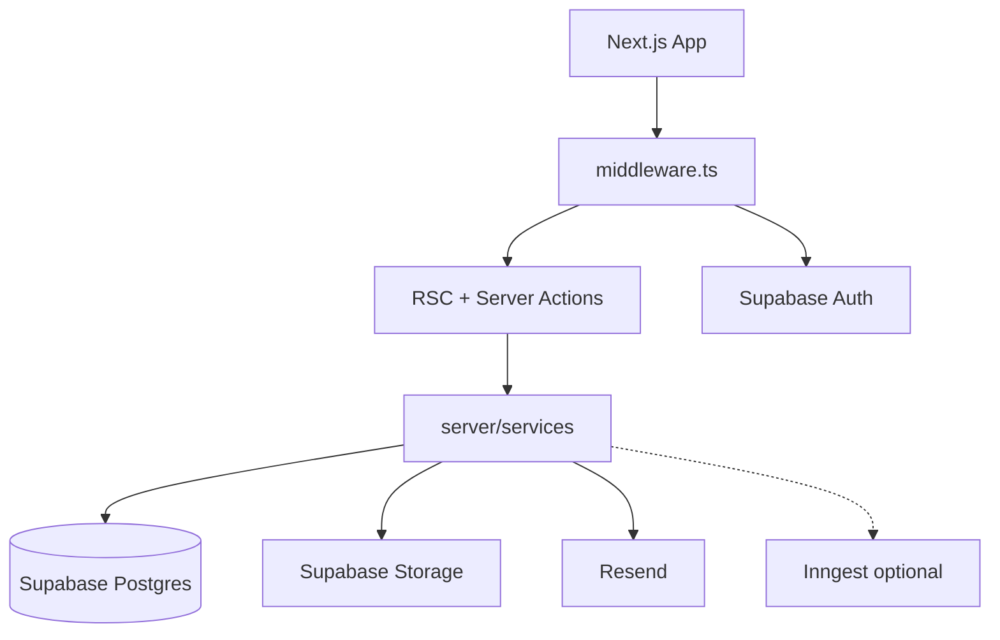

# riont — System Architecture

> **Master plan:** [MASTER_ARCHITECTURE.md](./MASTER_ARCHITECTURE.md)  
> **Stack:** Next.js 15 + Supabase (Postgres, Auth, Storage)  
> **Scope:** Order management + fulfillment — external payment only (no integrated payments, not planned)  
> **Payment workflow:** See **[PAYMENT_MODEL.md](./PAYMENT_MODEL.md)** (client-approved: external pay + admin confirm)

---

## 1. Architecture layers

```
┌─────────────────────────────────────────────────────────┐
│  Browser — React Client Components (forms, motion)      │
└───────────────────────────┬─────────────────────────────┘
                            │
┌───────────────────────────▼─────────────────────────────┐
│  Next.js 15 — Server Components + Server Actions        │
│  middleware: locale + Supabase session refresh          │
└───────────────────────────┬─────────────────────────────┘
                            │
┌───────────────────────────▼─────────────────────────────┐
│  Domain services (src/server/services/)                 │
│  auth · product · order · delivery · inventory ·        │
│  support · notification · coupon                        │
└─────────────┬───────────────────────┬───────────────────┘
              │                       │
┌─────────────▼──────────┐  ┌─────────▼─────────┐
│ Supabase Postgres      │  │ Supabase Storage    │
│ (RLS + RPC functions)  │  │ (public + private)  │
└────────────────────────┘  └─────────────────────┘
              │
┌─────────────▼──────────┐  ┌─────────────────────┐
│ Supabase Auth          │  │ Resend (email)      │
│ (Google/Apple/email)   │  │ Inngest (optional)  │
└────────────────────────┘  └─────────────────────┘
```

**Principle:** UI is thin. Supabase is infrastructure. Services encode business rules.

---

## 2. High-level diagram (Phase 1)



---

## 3. Supabase client architecture

| Module | Runtime | Key | Purpose |
|--------|---------|-----|---------|
| `lib/supabase/client.ts` | Browser | anon | Sign-in/up, `onAuthStateChange` |
| `lib/supabase/server.ts` | Server | anon + cookies | User session reads |
| `lib/supabase/admin.ts` | Server only | service_role | Admin writes, inventory, delivery |
| `lib/supabase/middleware.ts` | Edge | anon | Session refresh helper |

### 3.1 When to use which client

| Operation | Client |
|-----------|--------|
| Public catalog read (RSC) | server (anon) — RLS allows active products |
| Customer order list | server — user JWT + RLS |
| Guest order view | service validates token → **admin** or RPC |
| Admin product save | **admin** after `assertAdmin` |
| Inventory allocate | **admin** or `allocate_inventory` RPC |
| Storage upload (admin) | **admin** |
| Signed URL private file | **admin** generates URL |

### 3.2 Auth session flow

```
1. User signs in (Supabase Auth UI or custom form → supabase.auth.signInWithPassword/OAuth)
2. Cookies set via @supabase/ssr
3. middleware refreshes session on each request
4. Server Action: createServerClient → getUser()
5. Load profiles.role for authorization
6. Admin routes: role !== 'admin' → redirect
```

### 3.3 Profiles & roles

Table `profiles` (1:1 with `auth.users`):

| Column | Notes |
|--------|-------|
| id | uuid PK = auth.users.id |
| role | `customer` \| `admin` |
| locale | `en` \| `ar` |
| display_name | optional |

Created via:

- DB trigger on `auth.users` insert (default `customer`), **or**  
- Server Action on first login  

**Admin promotion:** manual SQL / Supabase dashboard for bootstrap; admin UI for roles optional post-MVP.

---

## 4. Order lifecycle

### 4.1 OrderStatus

`PENDING_REVIEW` → `AWAITING_PAYMENT` → `PAYMENT_RECEIVED` → `PROCESSING` → `DELIVERED` → `COMPLETED`  

Also: `CANCELLED`, `NEEDS_CUSTOMER_RESPONSE`, `ON_HOLD`

Every transition → `order_status_history` + optional `audit_logs`.

### 4.2 Customer submit flow

```
Product page (dynamic fields)
  → Server Action submitOrderAction
  → order.service.submitOrder()
      → Zod validate fields
      → encrypt sensitive OrderFieldValues
      → stock check (inventory count)
      → insert orders, order_items, order_field_values (admin client or RPC)
      → guest_order_access token if guest
      → notification.service → email admin + customer
  → Confirmation page + payment instructions (site_settings)
```

### 4.3 Admin workflow

```
Admin queue (status = PENDING_REVIEW)
  → Review order + decrypted fields (admin service)
  → transitionStatus(AWAITING_PAYMENT | CANCELLED | ON_HOLD)
  → Customer pays externally
  → transitionStatus(PAYMENT_RECEIVED)
  → delivery.service.startFulfillment() → PROCESSING
  → AUTO: fulfillOrderItem per line (RPC allocate)
  → MANUAL: support ticket + mark delivered
  → transitionStatus(DELIVERED → COMPLETED)
```

---

## 5. Delivery engine

### 5.1 Inventory allocation (Postgres RPC)

**Function:** `allocate_inventory(p_order_item_id uuid, p_quantity int)`

- `FOR UPDATE SKIP LOCKED` on `delivery_inventory`  
- Returns success/failure — called from `delivery.service.ts`  
- Avoids race conditions without Prisma transactions  

### 5.2 Auto-delivery trigger

Phase 1 options:

| Mode | When |
|------|------|
| Sync | Admin clicks "Start fulfillment" → immediate RPC |
| Async | Inngest job `fulfill-order-items` (recommended >20 orders/day) |

### 5.3 Encryption

Application-layer AES-256-GCM before insert into `payload_encrypted` columns.  
Supabase encryption-at-rest is additive, not sufficient alone.

---

## 6. Dynamic product fields

- Defined in `product_fields`  
- Validated with Zod built from DB rows  
- Stored in `order_field_values` (encrypted if `is_sensitive`)  
- Admin builder: Server Actions → `product.service`  

---

## 7. Support system

- `support_tickets` + `support_messages` + `support_attachments`  
- Attachments → `support-attachments` bucket (private)  
- Fulfillment tickets auto-created for MANUAL items in `PROCESSING`  
- Customer replies via Server Action → `support.service`  

---

## 8. Notifications

| Channel | Implementation |
|---------|----------------|
| In-app | `notifications` table insert |
| Email | Resend via `notification.service` (async Inngest optional) |

Templates: bilingual using order `locale`.

---

## 9. Storage architecture

### 9.1 Buckets

| Bucket | Access | Max size | MIME |
|--------|--------|----------|------|
| `product-images` | Public read | 2MB | image/jpeg, png, webp |
| `support-attachments` | Private | 5MB | image/*, application/pdf |
| `delivery-files` | Private | 10MB | application/pdf, text/plain |

### 9.2 Path conventions

```
product-images/{productId}/{uuid}.webp
support-attachments/{ticketId}/{messageId}/{uuid}.pdf
delivery-files/{orderItemId}/{uuid}
```

### 9.3 Upload flow

```
Client → Server Action (assertAdmin or assertUser)
  → validate file
  → admin.storage.from(bucket).upload(path, buffer, { contentType })
  → save path in DB row
```

### 9.4 Image optimization

- Store WebP where possible  
- Next.js `<Image>` with Supabase public URL in `remotePatterns`  

---

## 10. Catalog & caching

```typescript
// product.service — used by RSC
export const getActiveProducts = unstable_cache(
  async (locale) => { ... },
  ['catalog', locale],
  { revalidate: 60, tags: ['catalog'] }
)
```

Admin save → `revalidateTag('catalog')`.

---

## 11. Guest order tracking

Table `guest_order_access`:

- `order_id`, `token_hash`, `expires_at`  
- Customer receives raw token once on confirmation  
- `order.service.getOrderByGuestToken(token)` — constant-time compare hash  

Not tied to Supabase Auth `auth.uid()`.

---

## 12. Coupons

- Validate in `coupon.service` at submit  
- Snapshot code + discount on `orders`  
- Increment `usage_count` on `PAYMENT_RECEIVED` transition  

---

## 13. API surface (Phase 1)

| Entry | Use |
|-------|-----|
| Server Actions | All mutations + form posts |
| RSC | SEO pages, catalog |
| Route Handlers | `/api/health`, Inngest only |
| Supabase Realtime | **Not used** Phase 1 |

No payment webhooks.

---

## 14. Service module layout

```
src/server/services/
├── auth.service.ts
├── product.service.ts
├── order.service.ts
├── delivery.service.ts
├── inventory.service.ts
├── support.service.ts
├── notification.service.ts
└── coupon.service.ts

src/lib/
├── supabase/
├── encryption.ts
└── domain/
    ├── enums.ts
    └── schemas/

supabase/migrations/
└── *.sql
```

---

## 15. Performance notes

| Area | Pattern |
|------|---------|
| SEO pages | RSC + ISR/cache tags |
| Admin tables | `.range(offset, limit)` pagination |
| Inventory | Indexed `(product_id, status)` |
| Search | Postgres `ilike` for MVP |
| Connection pooling | Supabase pooler (transaction mode for RPC) |

---

*Schema & RLS: [DATABASE_ARCHITECTURE.md](./DATABASE_ARCHITECTURE.md)*  
*Rules: [IMPLEMENTATION_RULES.md](./IMPLEMENTATION_RULES.md)*
