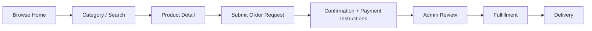
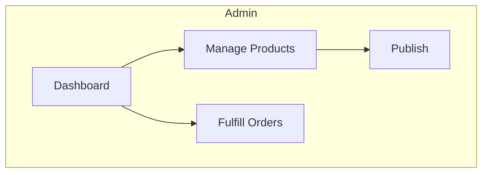

# UX Architecture & Page Specifications

> **Project:** riont  
> **Stack:** Next.js 15 + Supabase  
> Companion to [DESIGN_SYSTEM.md](./DESIGN_SYSTEM.md), [SYSTEM_ARCHITECTURE.md](./SYSTEM_ARCHITECTURE.md), [MVP_ROADMAP.md](./MVP_ROADMAP.md)  
> Defines information architecture, page wireframes, user flows, and responsive behavior.

---

## 1. Information architecture

```
PUBLIC STOREFRONT
├── Home
├── Categories
│   └── Category detail (filtered products)
├── Products
│   └── Product detail
├── Search results
├── Cart (optional)
├── Order request
│   ├── Review & submit
│   └── Confirmation
├── Auth (login / register / forgot)
└── Static (FAQ, Terms, Support)

CUSTOMER ACCOUNT
├── Dashboard (orders summary)
├── My Orders
│   └── Order detail (delivery reveal / manual status / ticket link)
├── Profile & Security
└── Support tickets
    └── Ticket thread (messages + attachments)

ADMIN (role-gated)
├── Dashboard (analytics)
├── Products (CRUD + inventory)
├── Orders
├── Customers
├── Categories
├── Coupons
├── Subscriptions
├── Analytics
├── Support tickets
└── Settings
```

---

## 2. Global layout behaviors

### 2.1 Storefront shell

| Zone | Content |
|------|---------|
| **Sidebar** | Logo, nav: Home, All Products, Categories (dynamic), category-type links (Accounts, Services, Keys, Tools as categories), promo widget, user block — **no Subscriptions/Wallet** (out of scope) |
| **Topbar** | Global search, notifications, cart, locale switcher (EN/AR) — **no wallet balance in MVP** |
| **Main** | Page content, max-width container optional on marketing pages |

### 2.2 Admin shell

- Sidebar: icon + label, collapsible on `<1280px`
- Topbar: breadcrumb, quick search, admin profile
- No promo widget; optional "View storefront" link

### 2.3 Scroll & sticky

- Topbar: sticky, `backdrop-blur` on scroll
- Checkout order summary: sticky on desktop (`top: topbar + 16`)
- Product purchase panel: sticky on desktop while gallery scrolls

---

## 3. Homepage

### 3.1 Section order (desktop)

1. **Hero** (min-height ~320px)
   - Left: Headline with accent keyword ("INSTANTLY" / gradient word)
   - Subcopy: trust line (Safe, Fast, Reliable)
   - CTAs: Primary "Shop Now" / "Market", Secondary "Explore"
   - Right: Featured 3D/visual product with ambient glow
2. **Trust bar** — 4 compact items in a row
3. **Popular categories** — grid, icon + name + count
4. **Featured / Popular products** — section header + "View all"
5. **Special offers** — countdown + limited deals carousel (optional v1)
6. **Testimonials** — 3 cards, avatar + quote + rating
7. **Footer** — links, payment icons, social, language switcher

### 3.2 Hero copy pattern

```
[Display-xl] DIGITAL PRODUCTS DELIVERED [accent]INSTANTLY[/accent]
[body-md muted] Safe, Fast, Reliable.
[Primary CTA] [Secondary CTA]
```

### 3.3 Trust bar items

| Icon | Title | Subtitle |
|------|-------|----------|
| Zap | Instant Delivery | Automated fulfillment |
| Shield | Secure Payments | Encrypted checkout |
| Headphones | 24/7 Support | Always available |
| Tag | Best Prices | Competitive rates |

### 3.4 Product card (grid)

- Logo/image 56px
- Title + category label
- Star rating + review count (compact)
- Price (accent) + optional strike discount
- "Best Seller" badge when applicable
- "Buy Now" or cart icon button
- "Instant Delivery" micro-badge

### 3.5 Mobile homepage

- Sidebar → hamburger → full-screen drawer
- Hero stacks: copy → visual → CTAs full-width
- Trust bar: 2×2 grid
- Products: 2-column grid
- **Bottom nav:** Home, Categories, Cart, Orders, Profile

---

## 4. Category pages

- Header: category name + description + product count
- Filters (sidebar drawer on mobile): price, rating, delivery type, in stock
- Sort: Popular, Price, Newest
- Product grid (same card component)
- Empty state: illustration + CTA to all products

---

## 5. Product detail page

### 5.1 Desktop layout (12-col)

| Col | Content |
|-----|---------|
| 5 | Gallery: main image 1:1 or 4:3, thumbnails row below |
| 7 | Info panel (sticky) |

### 5.2 Info panel (top → bottom)

1. Breadcrumb
2. Title (heading-lg)
3. Rating + review link
4. Price block: current, was-price, discount % badge (red pill)
5. Short feature list (checkmarks, max 4 visible)
6. **Delivery method** select (if variants)
7. **Dynamic required fields** (account email, region, etc. — product-driven schema)
8. Quantity stepper
9. CTA row: `Submit order` (primary), `Add to cart` (secondary, if cart enabled)
10. Wishlist link
11. Trust micro-copy (instant delivery, refund policy link)

### 5.3 Bottom tabs

| Tab | Content |
|-----|---------|
| Description | Rich HTML / markdown |
| What you receive | Bulleted deliverables |
| Requirements | Prerequisites, region locks |
| Reviews | Out of scope for MVP; optional static rating in admin only if needed |

### 5.4 Mobile product page

- Gallery full-width swipeable
- Sticky bottom bar: price + `Add to Cart` + `Buy Now`

---

## 6. Cart experience

### 6.1 Cart drawer (preferred UX)

- Slide from end (respects RTL)
- Line items: thumb, title, variant, qty stepper, remove
- Coupon field + apply
- Subtotal, discount, fees, **total** (bold, accent)
- CTA: Review order (primary full-width)

### 6.2 Full cart page (optional)

- Same content + recommended products row below

---

## 7. Order submission flow (Phase 1 — replaces checkout/payment)

### 7.1 Steps (stepper UI)

```
① Product / Cart  →  ② Review  →  ③ Confirmation
```

No payment step in Phase 1.

### 7.2 Review step

- Order lines readonly (product, qty, quoted price)
- Dynamic field answers summary (non-sensitive only; sensitive masked)
- Coupon discount line if applied
- **Quoted total** (informational — not charged on platform)
- Terms checkbox
- Guest: email field required
- Turnstile before submit
- CTA: **Submit order request** (primary)

### 7.3 Confirmation page

- Success state: "Order received"
- **Order number** large, mono, copy button
- Status badge: `Pending review`
- **How to pay** section (from SiteSettings):
  - Bank details, WhatsApp, crypto address, etc. (EN/AR)
  - Copy-friendly blocks
- Note: "We will confirm your order shortly"
- Guest: secure tracking link + "save this link"
- CTAs: View order status, Continue shopping

### 7.4 Order detail (customer) — status-driven UI

| Order status | Customer sees |
|--------------|---------------|
| `PENDING_REVIEW` | "We're reviewing your order" |
| `AWAITING_PAYMENT` | Payment instructions + contact support |
| `PAYMENT_RECEIVED` | "Payment confirmed — preparing" |
| `PROCESSING` | Progress / ticket link for manual |
| `DELIVERED` | Delivery reveal panel per item |
| `COMPLETED` | Thank you + reorder CTA |
| `NEEDS_CUSTOMER_RESPONSE` | Banner + reply in ticket |
| `ON_HOLD` | "On hold" + support CTA |
| `CANCELLED` | Reason if provided |

### 7.5 Payments (out of scope)

Checkout ends at **order submission** — no in-app Stripe/PayPal/Binance step. Customers pay externally; admins confirm in the panel. See [MVP_ROADMAP.md](./MVP_ROADMAP.md).

---

## 8. Authentication

### 8.1 Login modal / page

- Centered glass card max-w-md
- Social: Google, Apple (MVP)
- Divider "or"
- Email + password
- Forgot password link
- Sign In primary
- Register link below

### 8.2 Register

- Same layout + confirm password + terms checkbox

---

## 9. Customer account

### 9.1 My Orders

- Table/cards: order ID, date, total, status badge, action View
- Mobile: card list with chevron

### 9.2 Order detail

- **Order status** badge (Phase 1 statuses — not payment provider state)
- Timeline: Submitted → Review → Awaiting payment → Payment received → Processing → Delivered → Completed
- Product rows + delivery panel:
  - AUTO: click-to-reveal credentials / copy buttons
  - MANUAL: status message + linked support ticket thread
- Admin resend delivery → customer sees updated log entry (post-MVP UI if needed)
- "Report issue" → opens `ORDER_ISSUE` ticket pre-filled

### 9.3 Support tickets (customer)

- List: ticket number, subject, status, last updated
- Detail: message thread, reply box, attachment upload (allowlist types)
- Fulfillment tickets auto-created for MANUAL products

---

## 10. Admin dashboard

### 10.1 Dashboard home

**Row 1 — Stat cards (4)**

| Metric | Extras |
|--------|--------|
| Total Sales | Sparkline, % vs last period |
| Orders | count + trend |
| Customers | count + trend |
| Products | active count |

**Row 2 — Charts**

- Left (8 col): Sales overview area/line chart, range selector (7d / 30d / 90d)
- Right (4 col): Best sellers list (thumb, name, revenue)

**Row 3 — Recent orders table**

- Columns: Order ID, Customer, Product(s), Total, **Status**, Date, Actions
- Default filter: `PENDING_REVIEW`
- Quick actions: Accept, Mark paid, Start fulfillment, Message customer
- Status pills map to `OrderStatus` colors (see DESIGN_SYSTEM semantic colors)

### 10.2 Products management

- Toolbar: search, filter status, `+ Add Product`
- Table: Product (image+name), Category, Price, Sales, Status, Actions
- Add/Edit: slide-over or full page with tabs:
  - **General** — name, category, description (rich text), images (drag-drop)
  - **Pricing** — price, compare-at, cost
  - **Delivery** — AUTO/MANUAL, inventory import, payload type
  - **Checkout fields** — field builder (types, validation, sensitive flag)
  - **SEO** — per-locale slug, meta (EN + AR)
  - **Inventory** — stock count, bulk CSV import (auto products only)

### 10.3 Other admin sections

| Section | Primary UI |
|---------|------------|
| Orders | Filterable table + detail drawer |
| Customers | Table + profile drawer |
| Categories | Tree or table + icon upload |
| Coupons | Code, %, fixed, product/category rules, usage limits |
| Inventory | Encrypted stock list (masked), import CSV |
| Analytics | Basic charts MVP; extended rollups post-launch if needed |
| Support | Ticket queue, status, assignee |
| Settings | Site, payments, email, locales |

---

## 11. Search

- Topbar triggers overlay or dedicated `/search?q=`
- Instant suggestions (products + categories)
- Results page: filters + product grid
- Empty: popular products fallback

---

## 12. Responsive breakpoints

| Token | Width | Behavior |
|-------|-------|----------|
| `xs` | <480 | Single column, bottom nav |
| `sm` | 480–639 | 2-col products |
| `md` | 640–1023 | Sidebar drawer, condensed topbar |
| `lg` | 1024–1279 | Sidebar visible, 3–4 col grid |
| `xl` | 1280–1535 | Full layout, 4–5 col grid |
| `2xl` | ≥1536 | Max container centered |

---

## 13. Key user flows





---

## 14. State & loading UX

| State | Pattern |
|-------|---------|
| Page load | Route-level skeleton matching layout |
| Product grid | 8 card skeletons |
| Button submit | Inline spinner, disabled, preserve width |
| Error | Toast + inline field errors |
| Empty cart | Illustration + "Browse products" CTA |

---

## 15. SEO & meta (storefront)

See [SEO_ARCHITECTURE.md](./SEO_ARCHITECTURE.md) for full strategy. UX requirements:

- Locale prefix always visible (`/en`, `/ar`)
- hreflang in layout
- Product admin: per-locale slug + meta fields
- Language switcher preserves current page path

---

## 16. Admin: delivery & inventory UX

| Action | UI |
|--------|-----|
| View stock | Count only on product list; detail shows available/allocated/delivered counts |
| Import CSV | Drag-drop → preview row count → confirm → audit log entry |
| Manual fulfill | Order detail → "Mark delivered" + optional message/attachment |
| Resend auto | Button with confirm + rate limit message |
| Out of stock | Product shows badge; checkout disabled |

---

## 17. MVP scope

See [MVP_ROADMAP.md](./MVP_ROADMAP.md) for authoritative scope.

**In MVP:** Catalog, order request, external payment instructions, admin status workflow, AUTO + MANUAL delivery, support tickets, dynamic fields + encryption, admin ops, EN + AR RTL + SEO, Google + Apple + email auth.

**Not planned:** In-app payments (Stripe/PayPal/Binance), payment webhooks, subscriptions, wallet, provider refunds UI.

---

*RTL: [RTL_GUIDE.md](./RTL_GUIDE.md)*  
*Backend: [SYSTEM_ARCHITECTURE.md](./SYSTEM_ARCHITECTURE.md)*  
*Stack: [TECH_STACK.md](./TECH_STACK.md)*  
*Rules: [IMPLEMENTATION_RULES.md](./IMPLEMENTATION_RULES.md)*
